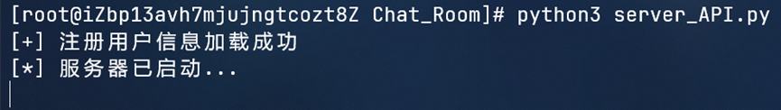
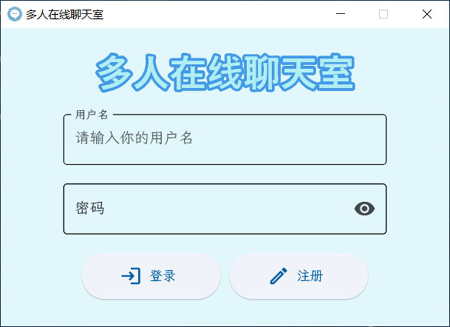
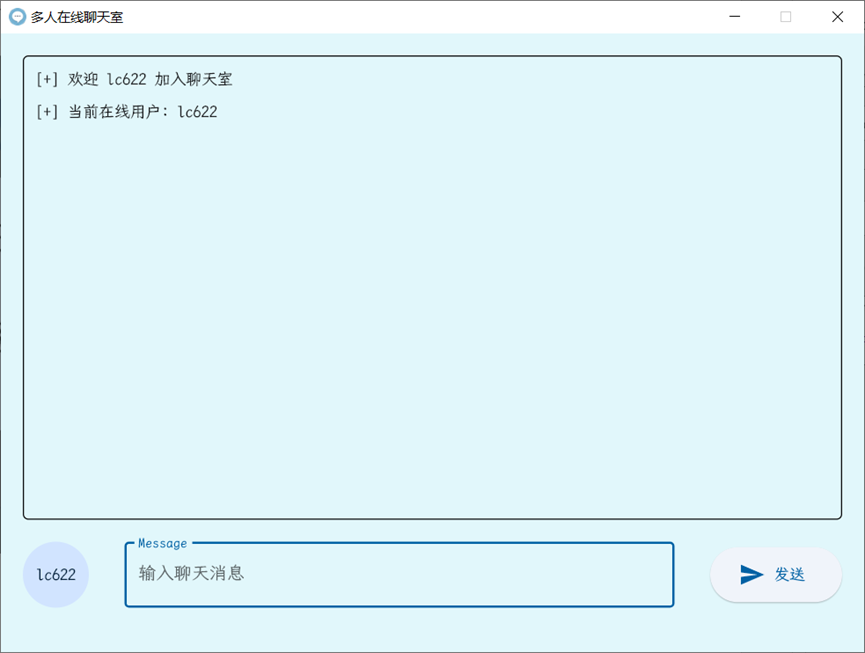

# Multi-User Online Chat Room

[English](README.md) | [简体中文](README_CN.md)

This is a multi-user online chat room application implemented in Python, based on UDP Socket communication. The project includes server-side and client-side components, supporting user registration, login, public chat, and private messaging functionalities.

For a detailed introduction to the project, please see my blog post: [Pi3's Notes](https://blog.pi3.fun/post/2023/12/%E5%9F%BA%E4%BA%8Eudp%E7%9A%84%E5%A4%9A%E4%BA%BA%E5%9C%A8%E7%BA%BF%E8%81%8A%E5%A4%A9%E5%AE%A4/)

## Features

- User registration and login system
- Public chat room
- Private messaging functionality
- Graphical User Interface (GUI)
- Online user list
- Server-side user management

## Tech Stack

- Python 3.x
- Socket programming (UDP)
- Threading for concurrent processing
- Flet for GUI development

## Project Structure

- `server.py`: Main server script
- `server_API.py`: Server API functionality
- `client.py`: Command-line client
- `client_API.py`: Client API functionality
- `GUI.py`: Graphical User Interface implementation
- `users.txt`: Text file for storing user information

## Installation

1. Clone the repository:
   ```bash
   git clone https://github.com/Pi3-l22/Socket_Chat_Room.git
   cd Socket_Chat_Room
   ```

2. Install dependencies:
   ```bash
   pip install flet
   ```

## Usage

1. Start the server:
   ```bash
   python server_API.py
   ```

2. Run the GUI client:
   ```bash
   python GUI.py
   ```

3. Or run the command-line client:
   ```bash
   python client.py
   ```

## GUI Client

The GUI client provides a user-friendly interface with the following features:

- Login/Registration interface
- Chat room main interface
- Message input box and send button
- Online user display

## Command-line Client

The command-line client supports the following commands:

- Register: `REGISTER <username> <password>`
- Login: `LOGIN <username> <password>`
- Public chat: Simply input the message
- Private message: `@<username> <message>`
- Exit: `exit`

## Customization

This project can be packaged into an exe file using [Pyinstaller](https://pyinstaller.readthedocs.io/en/stable/) for easy execution on Windows systems.

The project directory includes a font folder containing font files, which can be replaced with your preferred fonts.

`chat.png` is the program's logo, which can be replaced with your preferred image.

## Screenshots

Server



Client





## License

[MIT](LICENSE)
