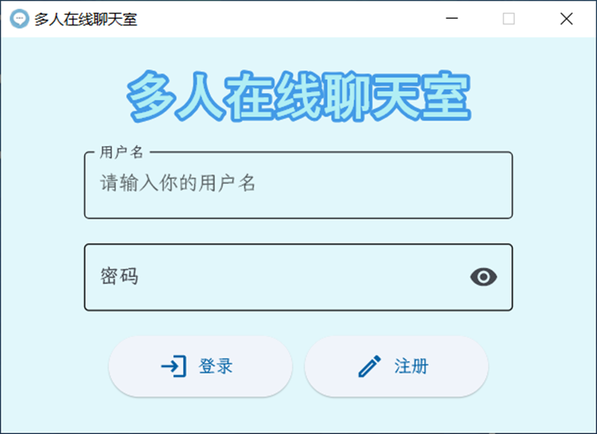
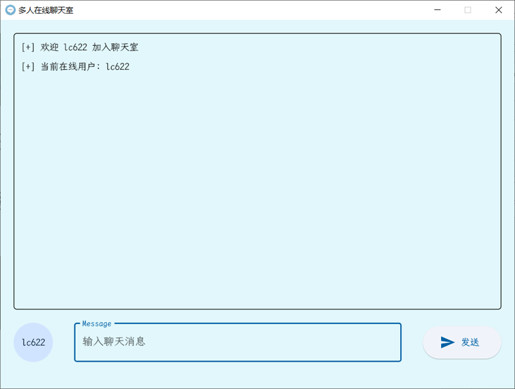

# 多人在线聊天室

[English](README.md) | [简体中文](README_CN.md)

这是一个使用Python实现的基于UDP Socket通信的多人在线聊天室应用。该项目包括服务器端和客户端组件，支持用户注册、登录、公共聊天和私人消息等功能。

项目的详细介绍可以参见我的博客文章：[Pi3'Notes](https://blog.pi3.fun/post/2023/12/%E5%9F%BA%E4%BA%8Eudp%E7%9A%84%E5%A4%9A%E4%BA%BA%E5%9C%A8%E7%BA%BF%E8%81%8A%E5%A4%A9%E5%AE%A4/)

## 功能特性

- 用户注册和登录系统
- 公共聊天室
- 私人消息功能
- 图形用户界面 (GUI)
- 在线用户列表
- 服务器端用户管理

## 技术栈

- Python 3.x
- Socket 编程 (UDP)
- Threading 用于并发处理
- Flet 用于GUI开发

## 项目结构

- `server.py`: 主服务器脚本
- `server_API.py`: 服务器API功能
- `client.py`: 命令行客户端
- `client_API.py`: 客户端API功能
- `GUI.py`: 图形用户界面实现
- `users.txt`: 存储用户信息的文本文件

## 安装

1. 克隆仓库:
   ```bash
   git clone https://github.com/Pi3-l22/Socket_Chat_Room.git
   cd Socket_Chat_Room
   ```

2. 安装依赖:
   ```bash
   pip install flet
   ```

## 使用方法

1. 启动服务器:
   ```bash
   python server_API.py
   ```

2. 运行GUI客户端:
   ```bash
   python GUI.py
   ```

3. 或者运行命令行客户端:
   ```bash
   python client.py
   ```

## GUI客户端

GUI客户端提供了一个用户友好的界面，包括以下功能:

- 登录/注册界面
- 聊天室主界面
- 消息输入框和发送按钮
- 在线用户显示

## 命令行客户端

命令行客户端支持以下命令:

- 注册: `REGISTER <username> <password>`
- 登录: `LOGIN <username> <password>`
- 公共聊天: 直接输入消息
- 私人消息: `@<username> <message>`
- 退出: `exit`

## 衍生

本项目可以利用[Pyinstaller](https://pyinstaller.readthedocs.io/en/stable/)打包成exe文件，方便在Windows系统上运行。

项目目录中包含一个font文件夹，里面是字体文件，可以替换为自己喜欢的字体。

`chat.png`是程序的logo，可以替换为自己喜欢的图片。

## 效果

服务端


客户端





## 许可证

[MIT](LICENSE)
